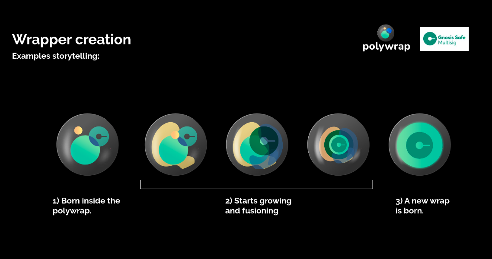

# Generative Polywrap Icons
For every published polywrapper, we'd like to create a unique svg animation which can be used as the polywrapper's icon.  

Here's an initial concept of what this might look like, taken from the new [Polywrap brand guide (credits to Mery)](https://github.com/polywrap/branding/blob/master/Polywrap_Brandbook_public_2021.pdf):  
  

# Deliverables  
## 1. Procedural Blob Animation Demo (Jordan)
https://icy-moon-8629.on.fleek.co/  
  

Source code can be found in this repository.

## 2. Spec -> SVG Animation (Colin)
https://codepen.io/cedric_waxwing/pen/PomYwMG  
  

# Design Requirements
- **Vanilla SVG**: In order to ensure this icon can be rendered everywhere (not just the browser), we'd like it to be a "vanilla" SVG file. Animations can be achieved using the [SMIL standard](https://www.w3.org/TR/SMIL3/).
- **Procedural Generation**: The polywrapper's unique SVG should be able to be procedurally generated given the polywrapper's URI. Heuristics can be gathered from the polywrapper's package, such as:
  * Number of dependencies (ex: ethereum, gnosis, etc)
  * Number of types used from each dependency
  * Bundle size (ex: "ethereum's query module is 500kb")
  * Metadata (ex: title, description, icon)

# Artistic Direction
## Brand Consistency
Polywrappers will have their own predefined "brand", and we should try to incorporate this as much as possible. This is why in the example above, the Gnosis logo is used in the "fully formed" state.

## Animation States
The animation states envisioned are as follows:
1. Fully Formed
- SVG of the Polywrap (gnosis.svg)
- Full circle in the center

2. Begin Transition
- Center logo shrinks and becomes transparent
- Blobs FOR EACH dependency emerge from the background
- Blobs are in their maximelly distorted form
- Blobs start from the center and move towards their end position

3. Morph some more (this can happen several times)
- add another morph shape for interesting visual transformation
- move the position slowly towards the end position

N. Fully Decomposed
- Circles for each dependency (ethereum, etc, etc)
- Full circles
